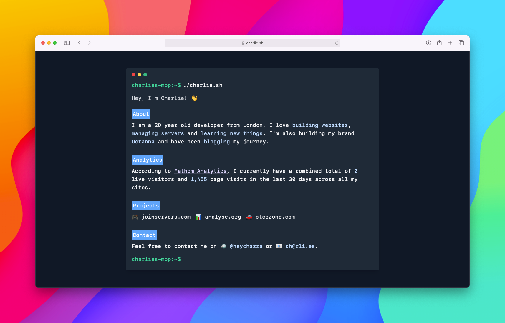

## About

This is the source code to my [website](https://charlie.sh) built with the __Laravel__ framework.

## Set-up

Simply clone this repository, install composer and node dependencies, copy `.env.example` to `.env`, and configure environment variables. Then run `npm run production` to build assets for production.

## Analytics

Across all of our projects at Octanna, we use [Fathom Analytics](https://charlie.sh/ref/analytics) as we care about user privacy. Here are just a few reasons why you may also enjoy using them:

- You don't need to display those pesky cookie notices as they don't use cookies, nor do they track invasive data.
- They offer simple, straight-forward website analytics.
- They are focused on privacy for website visitors, they don't track them, save their personal information, or need it to be profitable.
- They have thousands of customers and track tens of millions of page views per month, so they may be a small company, but we're doing big things.
- They can handle viral content without breaking a sweat, so your site won't slow down because of them, and they don't ever stop tracking you because of a spike in popularity.
- They've been featured in Fast Company as a great alternative to Google Analytics.
- All of their plans allow for unlimited websites to be tracked and receive our top-notch customer support.

## License

This source code is open-sourced software licensed under the [MIT license](https://opensource.org/licenses/MIT).
